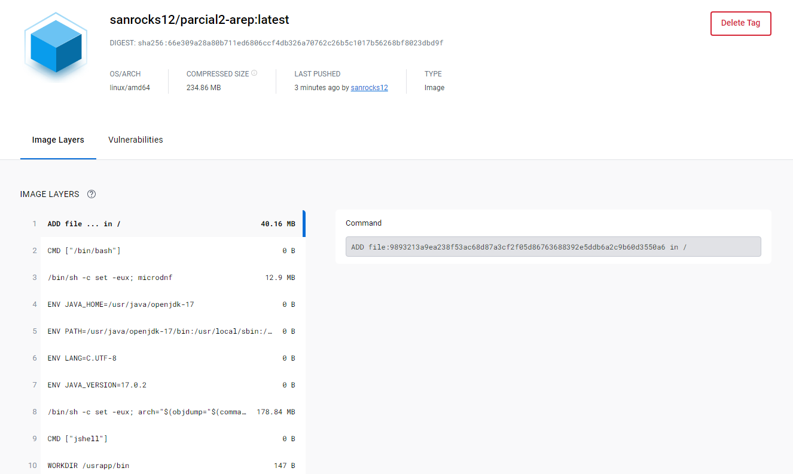
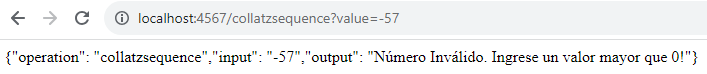
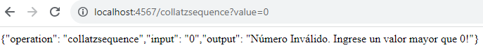
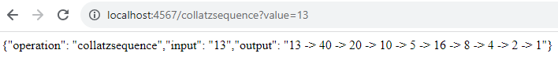
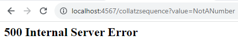

# Parcial Práctico 2
Por: Santiago Andrés Rocha

## Para Ejecutar el Parcial
### Local
1. Asegurarse de tener Git y Maven el el dispositivo
2. Clonar el Repositorio:
    ```
    git clone https://github.com/SanRocks1220/Parcial2-AREP.git
    ```
3. Actualizar dependencias:
    ```
    maven clean install
    ```
4. Correr el proyecto con alguna de las siguientes opciones:
    ```
    mvn exec:java
    java -cp "target/classes/;target/dependency/*" edu.eci.arep.ConjeturaCollatz
    ```
5. Acceder en el navegador a `localhost` en el puerto `4567` indicando el valor al que queremos investigar con la Conjetura de Collatz `collatzsequence?value=<Número requerido>`:   
    
    Ejemplo:
    ```
    localhost:4567/collatzsequence?value=13
    ```
### Remoto

## Imagen en DockerHub


## Evidencia de Funcionamiento Local

 *  Números Negativos   
 

 * Cero   


 * Números Positivos   


 * String   


## Evidencia de Funcionamiento Remoto

 * Números Negativos
 * Cero
 * Números Positivos
 * String

