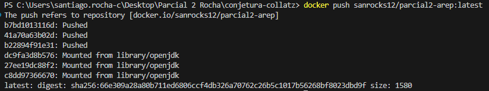

# Parcial Práctico 2
Por: Santiago Andrés Rocha

## Para Ejecutar el Parcial
### Local
1. Asegurarse de tener Git y Maven el el dispositivo
2. Clonar el Repositorio:
    ```
    git clone https://github.com/SanRocks1220/Parcial2-AREP.git
    ```
3. Actualizar dependencias:
    ```
    maven clean install
    ```
4. Correr el proyecto con alguna de las siguientes opciones:
    ```
    mvn exec:java
    java -cp "target/classes/;target/dependency/*" edu.eci.arep.ConjeturaCollatz
    ```
5. Acceder en el navegador a `localhost` en el puerto `4567` indicando el valor al que queremos investigar con la Conjetura de Collatz `collatzsequence?value=<Número requerido>`:   
    
    Ejemplo:
    ```
    localhost:4567/collatzsequence?value=13
    ```
### Remoto
1. Inicializar la instancia de EC2 en AWS
2. Acceder en el navegador a `ec2-54-166-217-163.compute-1.amazonaws.com` en el puerto `4567` indicando el valor al que queremos investigar con la Conjetura de Collatz `collatzsequence?value=<Número requerido>`:   
    
    Ejemplo:
    ```
    ec2-54-166-217-163.compute-1.amazonaws.com:4567/collatzsequence?value=13
    ```

    * Nota: Para hacer que AWS funcionase, fue necesario la configuración de los Puestos en Seguridad, instalar Docker en la instancia de EC2 y bajar la imágen de:
    ```
    docker push sanrocks12/parcial2-arep:latest
    ```

    
    

## Imagen en DockerHub


## Evidencia de Funcionamiento Local

 *  Números Negativos   
 

 * Cero   


 * Números Positivos   


 * String   


## Evidencia de Funcionamiento Remoto

 * Imagen de Docker en AWS   
 

 * Servidor corriendo la Imagen
 

 * Números Negativos   
 

 * Cero   
 

 * Números Positivos   
 

 * String   
 


## Link al video comprobando funcionamiento:
* [Video de Funcionamiento](https://youtu.be/HFpjm0Rd0i8)
